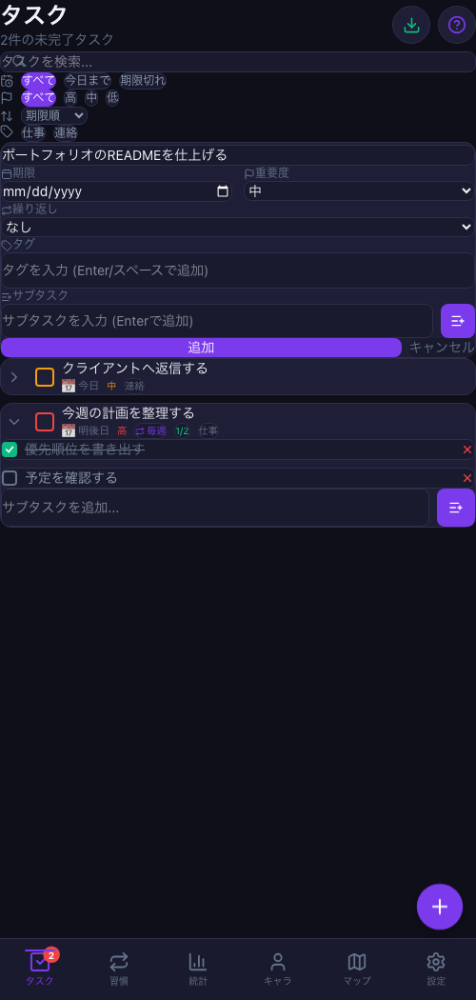
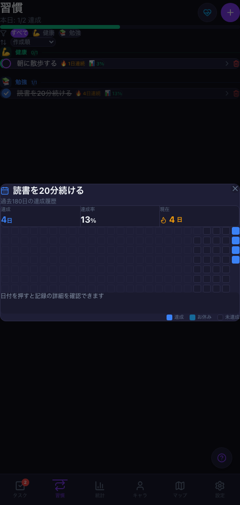
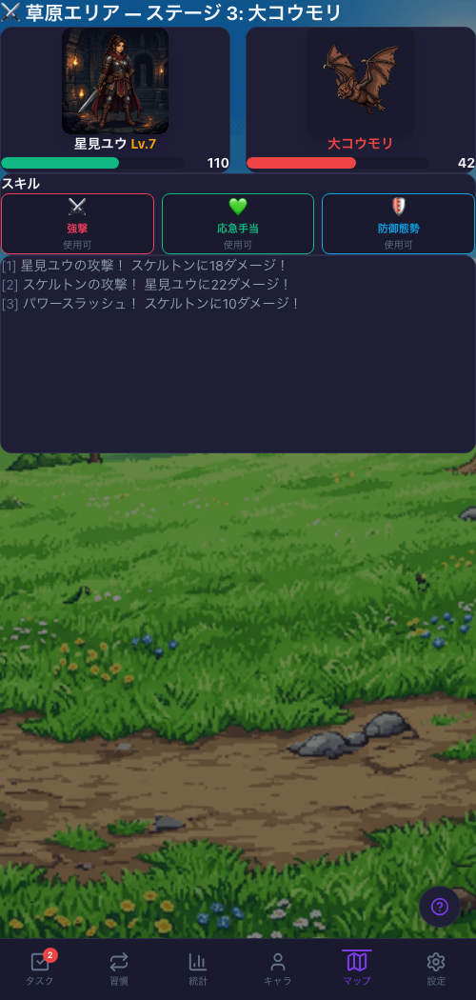
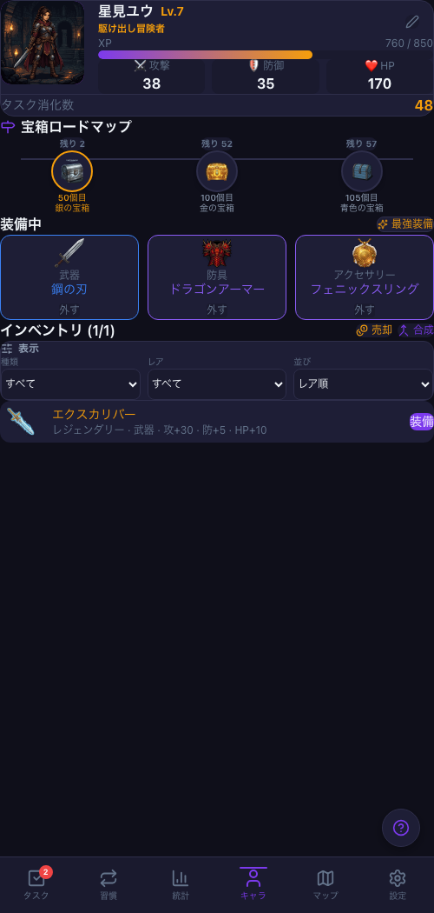
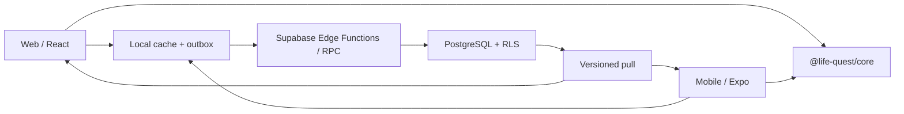

# Life Quest

**タスク管理をRPGの進行に変える、Web / Mobile対応のゲーミフィケーションアプリ**

[](https://github.com/YuTakane256/Life-Quest/actions/workflows/ci.yml)
[](https://github.com/YuTakane256/Life-Quest/actions/workflows/e2e.yml)
[](https://react.dev/)
[](https://expo.dev/)
[](https://supabase.com/)
[](https://www.typescriptlang.org/)

Life Questは、日々のタスクや習慣の達成を、キャラクター育成・装備収集・マップ攻略へつなげる個人開発プロジェクトです。単なる演出付きToDoアプリに留めず、React製WebクライアントとExpo / React Native製Mobileクライアントを、共有ドメインロジックとSupabaseバックエンドで接続しています。

ログイン中はタスク、習慣、キャラクター、インベントリ、報酬、バトル進行をユーザー単位で同期します。未ログインでも端末内で利用でき、既存ローカルデータからクラウドへ移行する経路を備えています。

## Screenshots

| タスク管理 | 習慣管理 |
| --- | --- |
| [](docs/screenshots/portfolio/web-tasks.png) | [](docs/screenshots/portfolio/web-habits.png) |
| 優先度、期限、繰り返し、タグ、サブタスクをまとめて管理 | 日々の達成、休息日、連続記録を可視化 |

| マップ・バトル | 宝箱と報酬 |
| --- | --- |
| [](docs/screenshots/portfolio/web-battle.png) | [](docs/screenshots/portfolio/web-chest.png) |
| 装備ステータスとスキルを使って複数エリアを攻略 | 宝箱から装備を獲得し、売却・合成・装備へつなげる |

| キャラクター・インベントリ |
| --- |
| [](docs/screenshots/portfolio/web-character.png) |
| 装備によるステータス変化と、宝箱から獲得したアイテムを管理 |

## 主な機能

- **タスク管理**: 優先度、期限、タグ、検索、並び替え、繰り返し、サブタスク、複製、一括削除、完了取り消し
- **習慣管理**: カテゴリ、メモ、休息日、ストリーク、達成率、履歴ヒートマップ
- **ゲーム進行**: タスク・習慣の報酬、レベル、キャラクターステータス、ログインボーナス、実績・称号
- **装備とインベントリ**: 宝箱、レアリティ、装備変更、売却、3アイテム合成、フィルター・並び替え
- **マップ・バトル**: 4エリア・40ステージ、ターン制戦闘、スキル、戦闘履歴・リプレイ
- **統計**: タスク・習慣の推移、XP、ヒートマップ、実績進捗
- **設定**: ダーク / ライト / システムテーマ、モーション、通知、バックアップ、同期状態、アカウント管理
- **クロスプラットフォーム**: WebとMobileで共有するアカウント、データ、ゲームルール、画像アセット、デザイントークン

## 技術的な見どころ

### 1. UIではなくドメインを共有するモノレポ

WebはReact DOM、MobileはReact Nativeとして個別のUIを維持しながら、タスク・習慣・成長計算・装備・報酬・バトル・同期を`@life-quest/core`へ集約しています。画像は`@life-quest/assets`、色や余白などは共通デザイントークンを参照し、プラットフォーム固有の操作性を保ったまま結果を揃えています。

### 2. Supabaseを正とするWeb / Mobile同期

認証にはSupabase Auth、永続化にはPostgreSQLを使用しています。ログイン中の変更は端末内へ即時反映した後、永続outboxから再送されます。Realtimeは変更通知に限定し、実データは`pull_sync_batch` RPCからversion単位で取得することで、テーブル別ページングによる取りこぼしを避けています。



### 3. ゲーム報酬の整合性とサーバー権威

完了状態を繰り返し切り替えて報酬を重複取得できないよう、タスク報酬は生涯1回のルールと冪等キーで保護しています。宝箱、合成、売却、バトル結果などはEdge FunctionsとDB関数を経由し、クライアントの自己申告だけでXPやアイテムが増えない構成です。バトルはattempt単位で再挑戦報酬を許可しつつ、同じ結果の二重送信を防ぎます。

### 4. ユーザー境界と障害復旧

RLSに加えて、service roleを利用するEdge FunctionでもJWT由来のユーザーIDと所有権を検証します。ローカルキャッシュとoutboxはユーザーIDごとのnamespaceへ分離し、ログアウト時にはメモリ状態を破棄します。オフライン時の操作は同じoperation IDで再送され、再起動・再接続後も保留操作を復元します。

設計上の判断と背景は[Architecture Decision Records](docs/adr/README.md)に記録しています。

## 技術スタック

| 領域 | 採用技術 |
| --- | --- |
| Web | React 19, React Router 7, Vite 8, Tailwind CSS 4 |
| Mobile | Expo 57, React Native 0.86, Expo Router |
| 言語・状態管理 | TypeScript 6, Zustand 5 |
| Backend | Supabase Auth, PostgreSQL 17, RLS, Realtime, Edge Functions |
| Test | Vitest, Playwright, pgTAP, Maestro（ローカル画面比較） |
| Quality | ESLint, TypeScript project references, GitHub Actions, Dependabot |

## リポジトリ構成

```text
Life-Quest/
├── src/                 # Webクライアント
├── apps/mobile/         # Expo / React Nativeクライアント
├── packages/core/       # プラットフォーム非依存の型・ドメイン・同期ロジック
├── packages/assets/     # Web / Mobile共有のキャラクター・敵・装備画像
├── supabase/
│   ├── migrations/      # スキーマ、RLS、RPC、整合性制約
│   ├── functions/       # 認可・ゲーム操作を担うEdge Functions
│   └── integration/     # 2クライアント同期などの統合テスト
├── e2e/                 # Web操作・ビジュアル回帰テスト
└── docs/adr/            # アーキテクチャ決定記録
```

## ローカル起動

### 必要な環境

- Node.js `22.22.2`以上、23未満
- npm
- Mobile確認時: Expoを実行できるiOS / Android環境
- クラウド同期をローカルで確認する場合: DockerとSupabase CLI（npm依存に含まれます）

### Web

```bash
git clone https://github.com/YuTakane256/Life-Quest.git
cd Life-Quest
npm ci
npm run dev
```

`http://localhost:5173`を開きます。Supabaseを設定しない場合も、未ログインのローカルモードで主要機能を確認できます。

### Mobile

```bash
npm ci
npm run mobile:start
```

表示されるExpoの案内から、シミュレータまたは実機で起動します。

### Supabaseを含むローカル環境

```bash
npm run db:start
```

出力されたローカルURLとanon keyを`.env.example`に記載されたWeb / Mobile用の環境変数へ設定します。`service_role` keyはクライアント環境へ設定しません。スキーマを初期状態へ戻す場合は`npm run db:reset`を使用します。

## テストと品質確認

```bash
npm run typecheck          # Web全体の型検査
npm run typecheck:core     # 共有ドメインの型検査
npm run mobile:typecheck   # Mobileの型検査
npm run lint               # 静的解析
npm test                   # ユニット / コンポーネントテスト
npm run test:integration   # Supabase統合テスト
npm run db:test            # RLS・DB関数のpgTAPテスト
npm run e2e                # Playwright E2E
npm run e2e:parity         # 390 x 844のWeb画面回帰テスト
npm run build              # Web本番ビルド
npm run mobile:export      # Android向けExpo export
npm run mobile:validate-release # EAS profile / 公開Expo設定の静的検査
```

Pull Requestでは型検査、lint、テスト、Web build、Mobile export、Expo公開設定、Playwright E2E、秘密情報の混入検査をGitHub Actionsで実行します。依存関係はDependabotと週次の`npm audit`で監視しています。iOSシミュレータを使うMobileスクリーンショット比較は[チェックリスト](docs/mobile-parity-checklist.md)に沿ってローカルで行います。EASのdevelopment / preview / productionビルド準備は[Mobileリリースチェックリスト](docs/mobile-release-checklist.md)を参照してください。

## 実装状況

Web / Mobileの主要画面、メール認証、クラウド同期、オフラインoutbox、サーバー権威のゲーム操作まで実装しています。現在は、画面差分の回帰テスト拡充や認証方式の追加など、公開品質を高める作業を継続しています。進行中・検討中の内容は[Issues](https://github.com/YuTakane256/Life-Quest/issues)を参照してください。

## 補足資料

- [ADR一覧](docs/adr/README.md)
- [Web / Mobile差分監査](docs/mobile-web-parity-audit.md)
- [Mobile / Web画面比較手順](docs/mobile-parity-checklist.md)
- [Mobileリリースチェックリスト](docs/mobile-release-checklist.md)
- [メール認証セットアップ](docs/email-auth-setup.md)

## License

現時点でライセンスは設定していません。ソースコードの再利用・再配布については、リポジトリ所有者へ確認してください。
