# 2026-10-10：共通レイアウト・下部ナビゲーション

#690の第一段。最新Webの余白修正後を基準に、Mobileの6タブのLucideアイコン、選択インジケーター、10ptラベル、未完了件数、未解放マップ、64ptの操作領域を統一。下部safe areaはタブだけで確保し、画面側の二重の余白を解消。画面見出し24/32pt・上余白24pt、タスク/習慣/統計の横余白16pt、キャラ/設定/マップの横余白20pt、主要カードの角丸12ptを共有トークン化した。

架空匿名データ・2026-08-10 21:00 JST・動き低減。Web402×874 CSS px / iPhone 18 Pro402×874 pt（PNGは3倍）。OSステータスバー・safe area・フォント描画の微差は一致対象外。画像は加工していない。

| 画面 | Webライト | Mobileライト | Webダーク | Mobileダーク |
| --- | --- | --- | --- | --- |
| タスク |  | 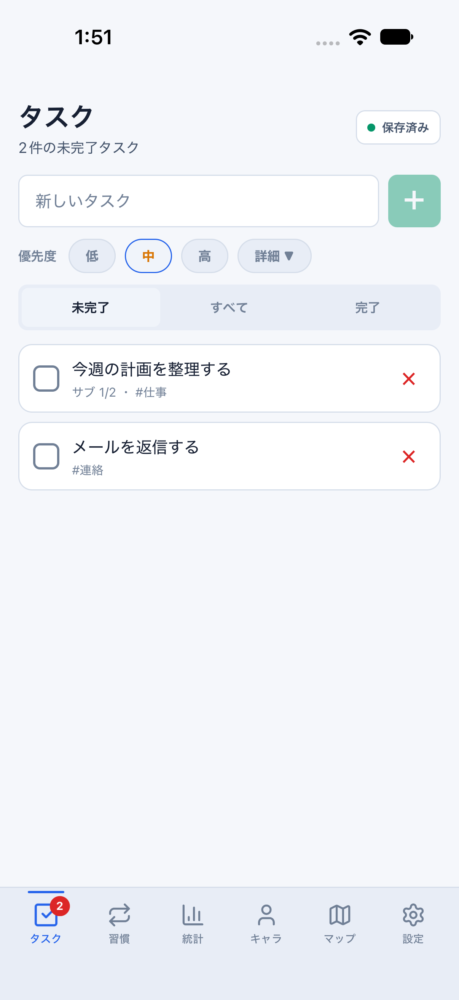 |  | 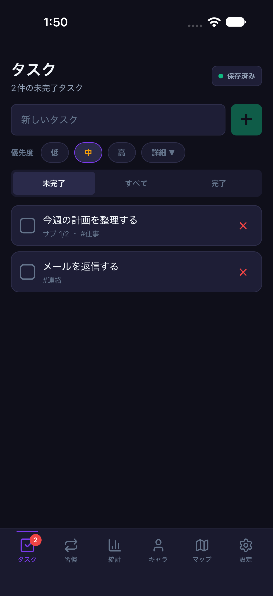 |
| 習慣 |  | 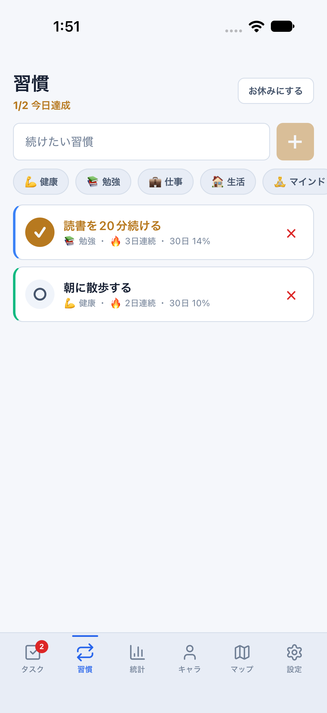 | 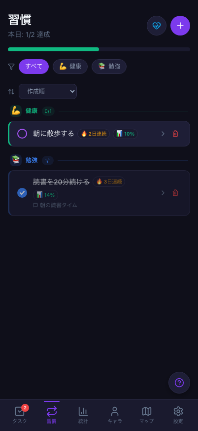 | 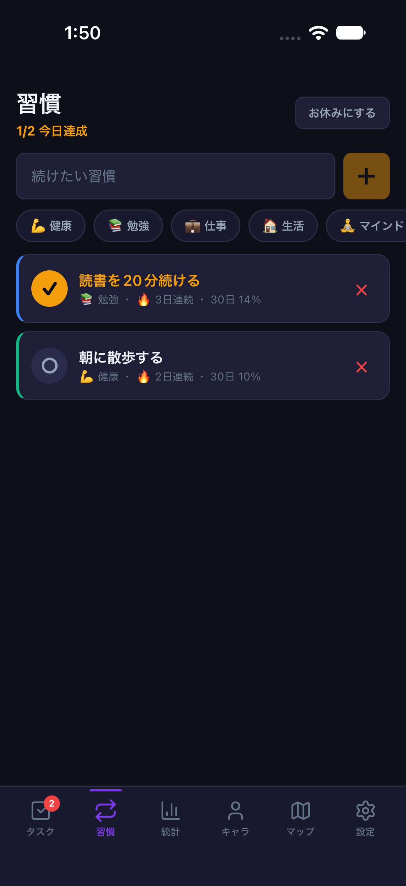 |
| 統計 | 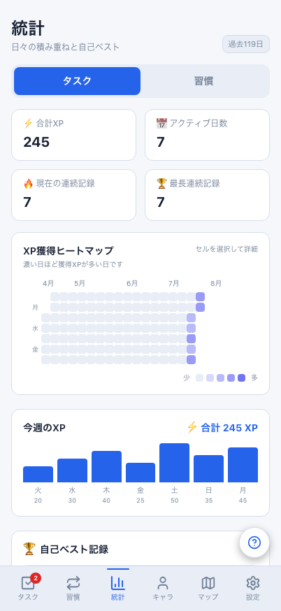 | 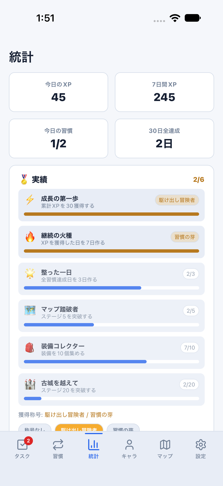 |  | 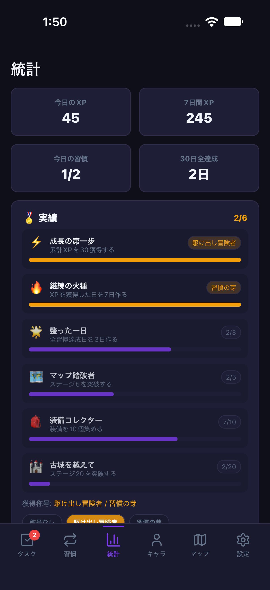 |
| キャラ | 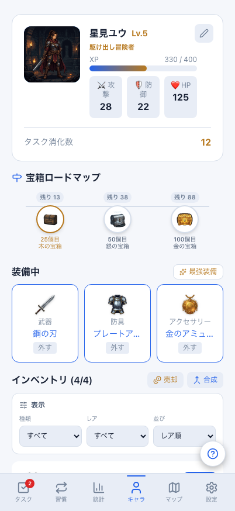 |  |  | 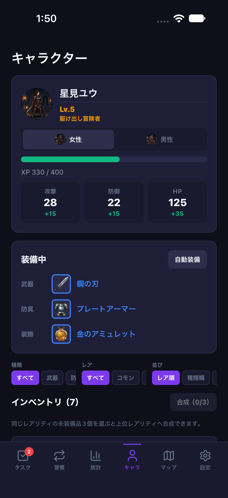 |
| インベントリ | 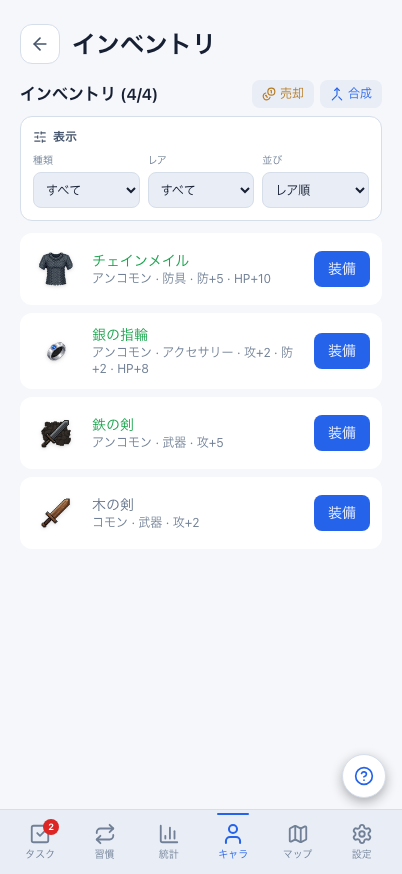 | 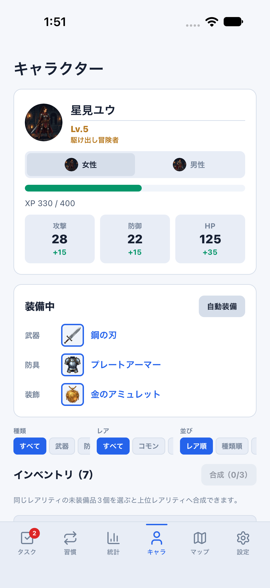 | 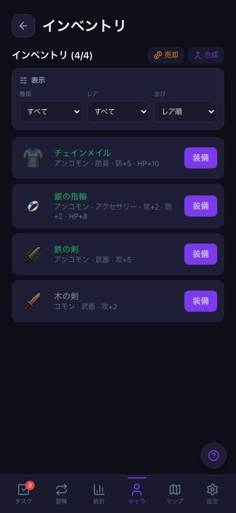 |  |
| 設定 |  | 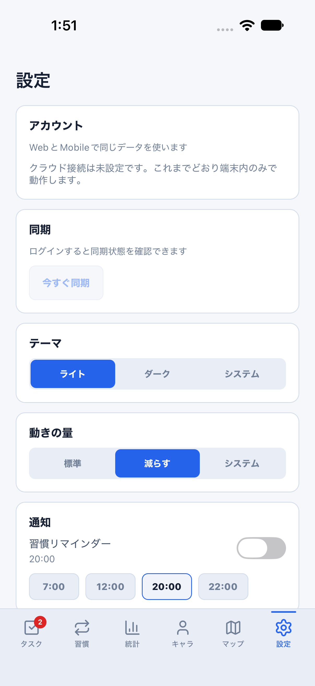 |  | 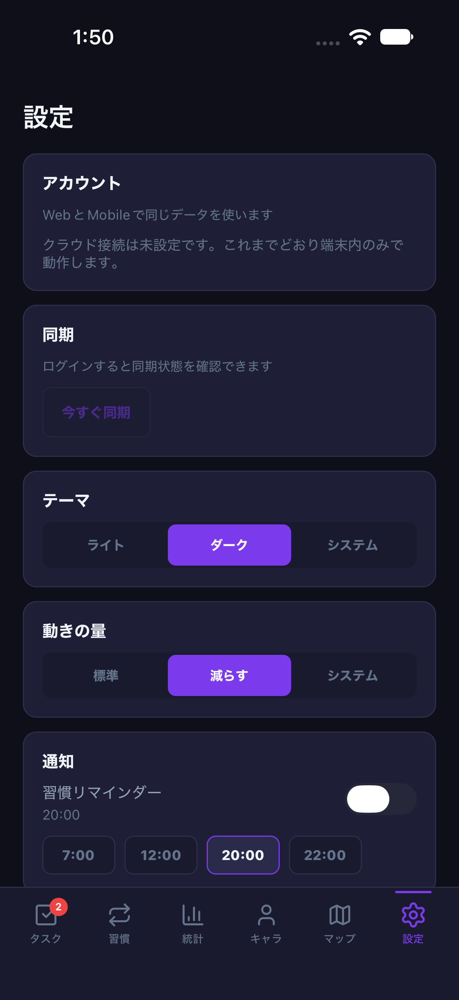 |

## 判定と残る差

- 共通ナビ：両テーマの6画像を確認。通常の匿名smokeで未解放マップがdisabled、比較fixtureで解放済みマップに移動できることを確認。入力・タブ移動・再起動後の保存も通常モードで確認。
- 各画面全体の見た目：**まだ一致ではない**。常時フォーム/完了一覧は#691、習慣配置は#692、設定・ヘルプのカード順序は#693、プロフィール画像/成長配置は#694、独立インベントリは#695、統計構成は#696、マップ/戦闘は#697で対応。
- #690はこのPRだけでは閉じない。画面内ボタン/小アイコン/選択部品の素材・大きさ、空/入力/エラー状態の詳細比較は残る。各画面変更時に共通部品を整理し、#690の最終判定を行う。
- 大きい文字でナビが伸びる計算は単体テスト済み。Androidはバンドル生成までで、実機表示・大きい文字の実端末操作は#699で検証する。
- DB/API/保存形式/報酬計算/通常版の初期テーマsystemは変更なし。画像用メモリ状態は同期/認証/永続化の合格証拠には使わない。

変更前は[棚卸し時のMobile](../parity-baseline/README.md)、Webの基準修正は[余白修正](../web-spacing-fix/README.md)。再現方法は[比較手順](../../mobile-visual-reference.md)。
