# 2026-10-09：画面統一前の同条件比較

#689 / #688。架空匿名データ、2026-08-10 21:00 JST、Web402×874 CSS px / iPhone 18 Pro402×874 pt、動き低減。Mobile PNGは3倍解像度。OSステータスバー・safe area・フォント描画の微差は一致対象外。

これは**差分の棚卸し**であり、見た目の一致に合格した画像ではない。Webの余白上書き不具合 #701 は別PRで先行修正する。タスクはWebで完了一覧展開、Mobileで未完了が既定。インベントリはWebで未装備4件の独立route、Mobileでは装備中も含む7件の埋め込み。これらは#691/#695の解消対象で、fixtureの中身の差ではない。

| 画面 | Webライト | Mobileライト | Webダーク | Mobileダーク |
| --- | --- | --- | --- | --- |
| タスク | 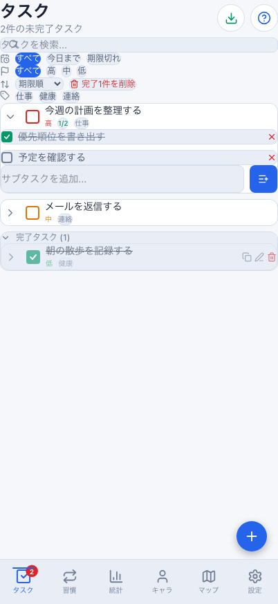 |  | 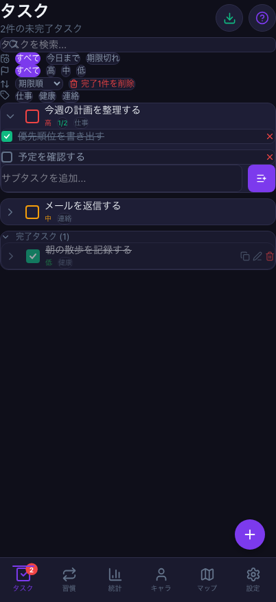 |  |
| 習慣 | 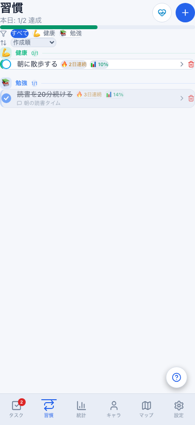 |  | 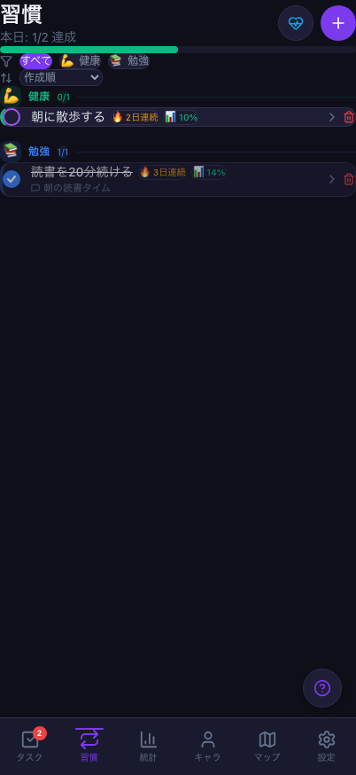 |  |
| 統計 | 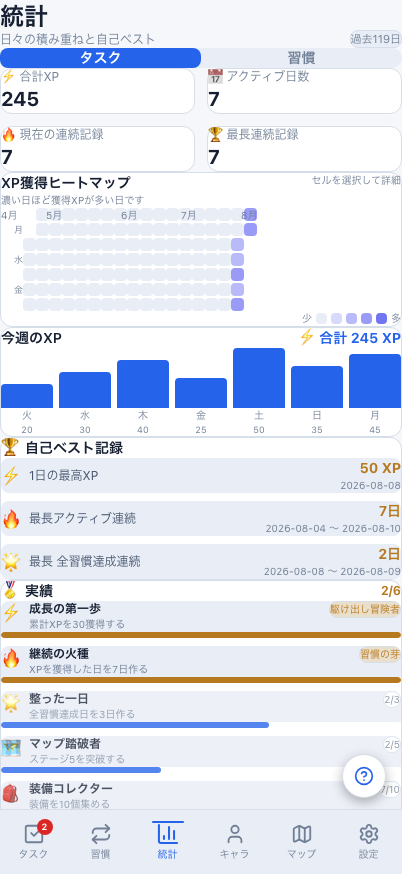 |  | 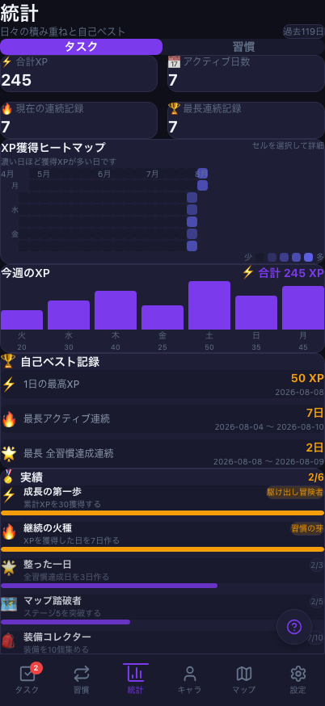 |  |
| キャラ | 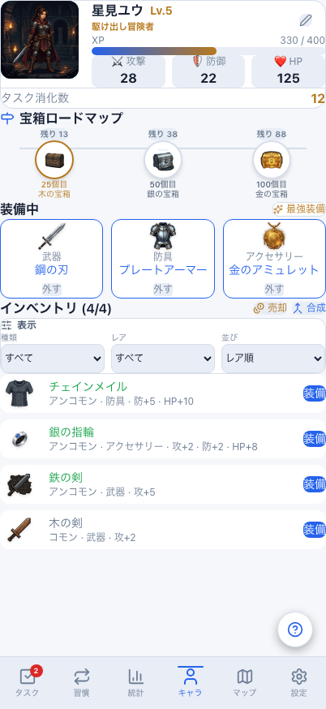 |  | 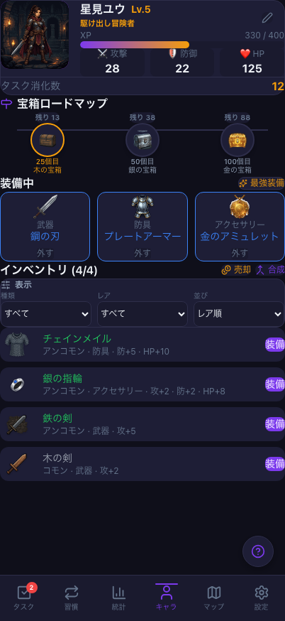 |  |
| インベントリ | 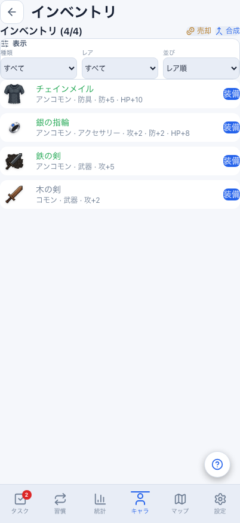 |  | 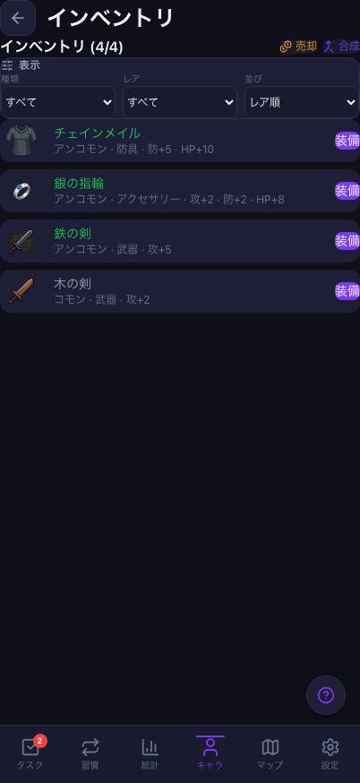 |  |
| 設定 | 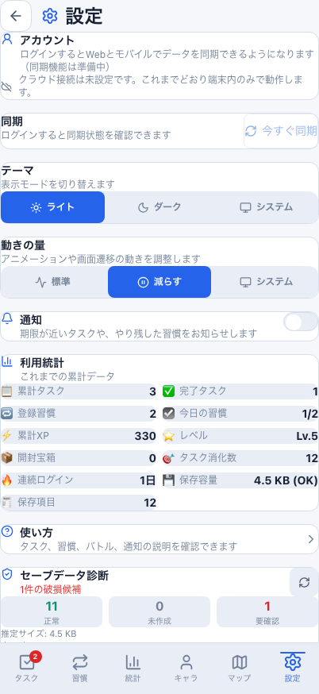 |  | 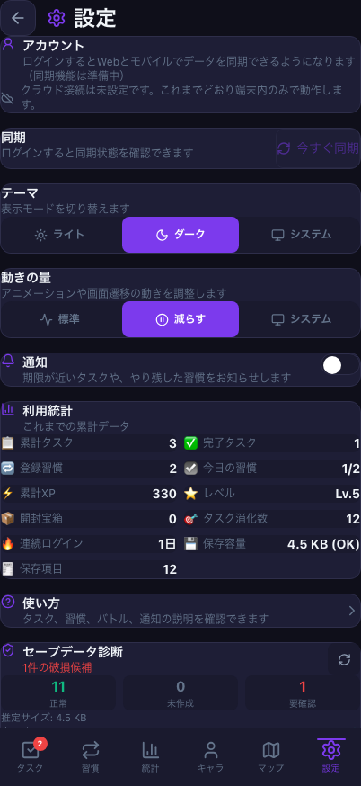 |  |

再現手順は[比較手順](../../mobile-visual-reference.md)。画像用メモリ状態を同期/永続化/報酬検証には使用しない。
