# Webの余白修正後：Mobileが合わせる比較基準

#701。2026-10-09、#702と同じ架空匿名データ・2026-08-10 21:00 JST・両テーマ・402×874 CSS px。

Tailwindのbase-layer preflightがすでにmargin/padding/box-sizingを初期化しているため、`src/index.css`の重複したunlayered universal resetを削除した。これで各画面のpx/py/margin utilitiesが優先される。本来のページ左右16/20px、上24px、フォームの左右12px/上下10px、モバイルナビ64pxをブラウザーで検証した。デスクトップの既存216/232px sidebarも維持。

[修正前の比較画像](../parity-baseline/README.md)は履歴として残す。以下のWebを#690以降の画面統一の基準とする。MobileはこのPRでは変更していないため、まだ見た目の一致には合格していない。情報順序・フォーム・独立インベントリ等は後続Issueで対応する。

| 画面 | 修正後Webライト | 現在Mobileライト | 修正後Webダーク | 現在Mobileダーク |
| --- | --- | --- | --- | --- |
| タスク | 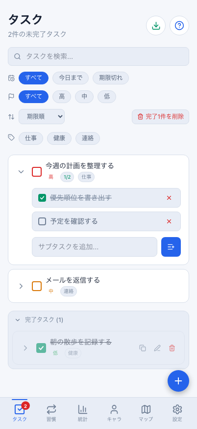 | 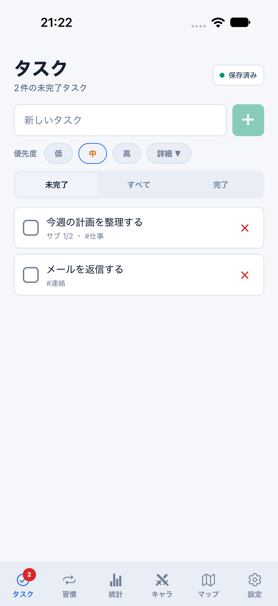 | 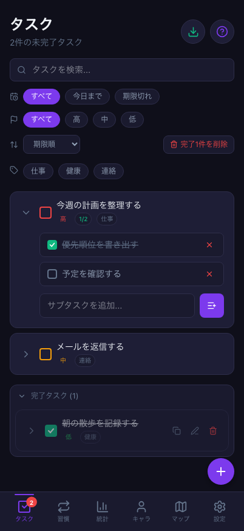 | 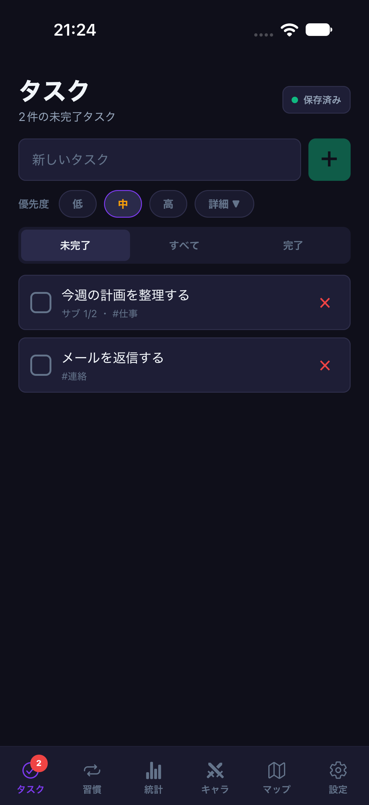 |
| 習慣 | 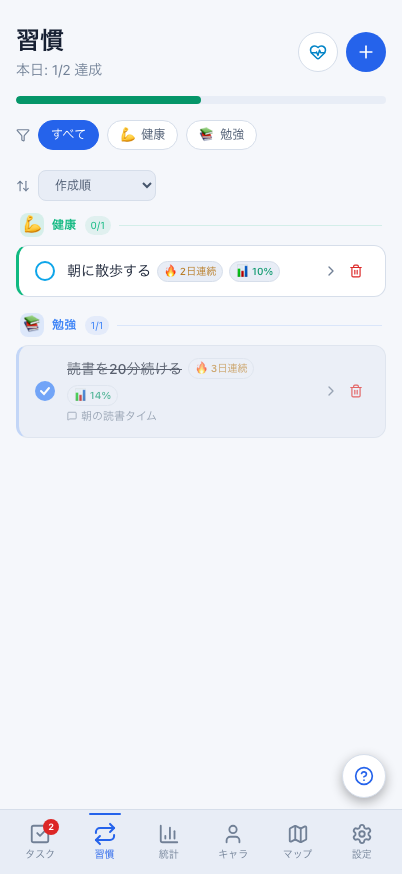 | 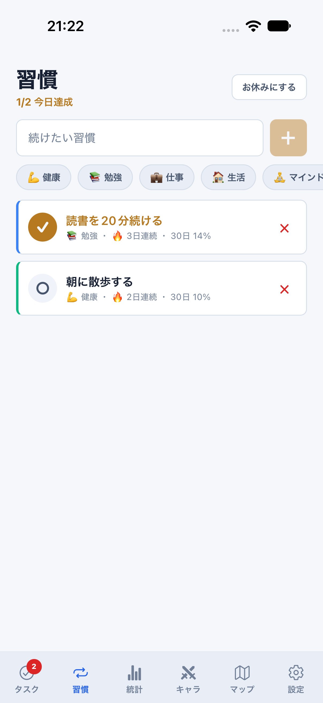 |  | 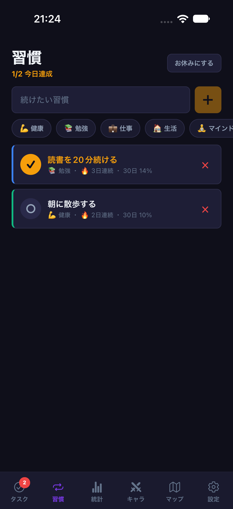 |
| 統計 |  | 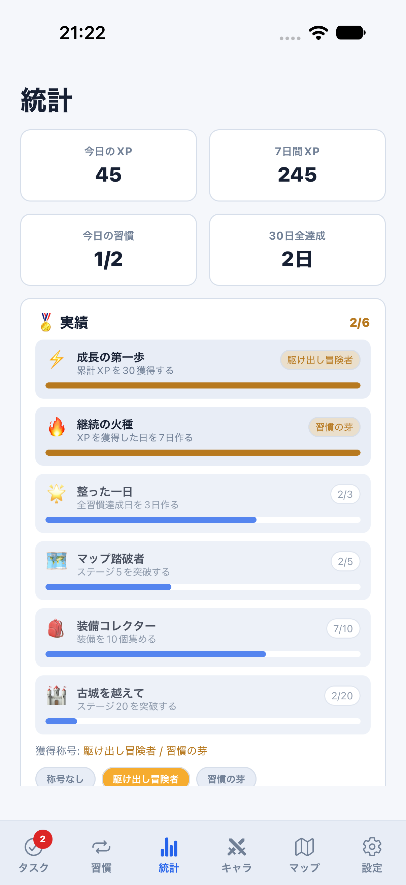 | 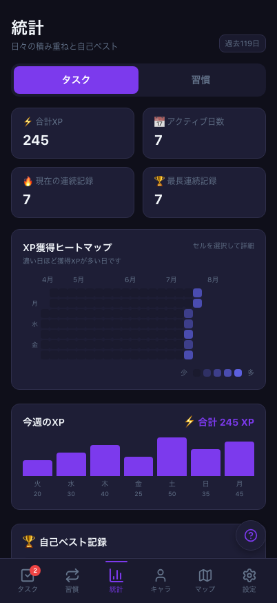 | 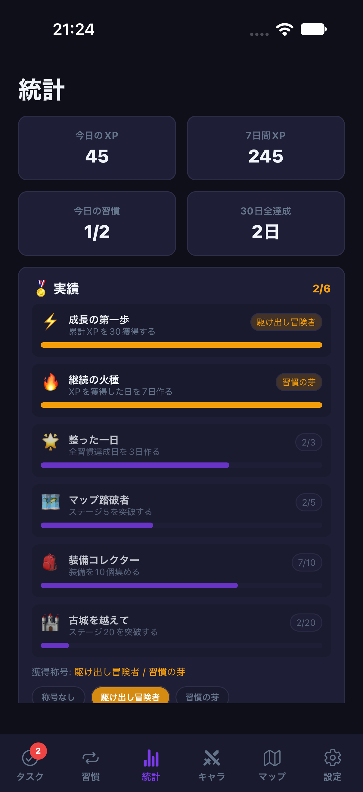 |
| キャラ | 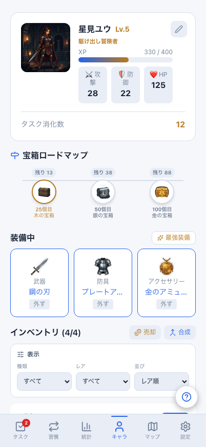 |  | 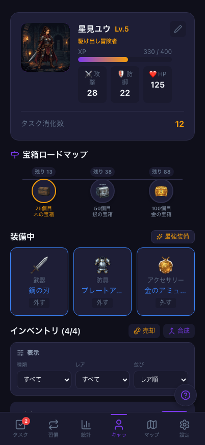 | 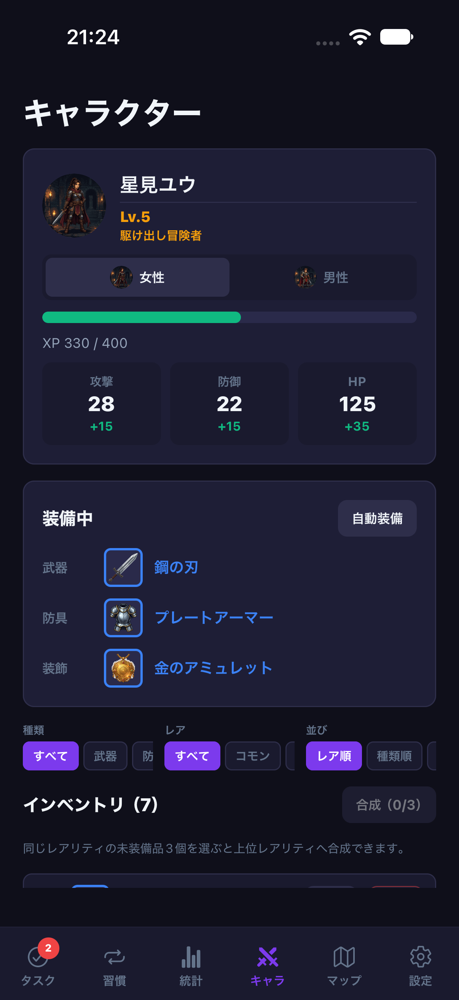 |
| インベントリ | 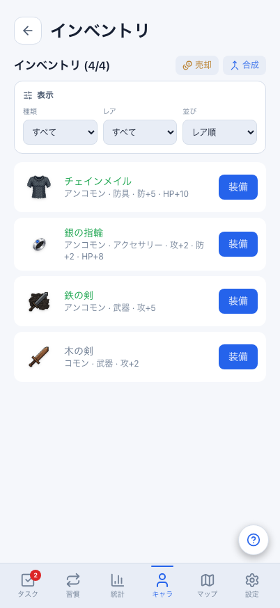 | 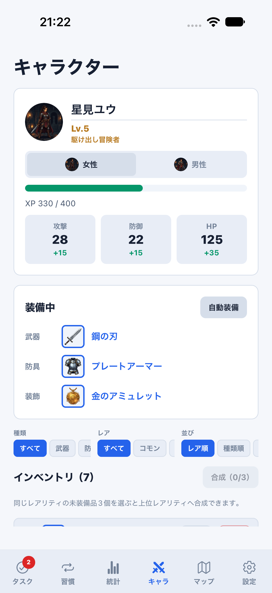 | 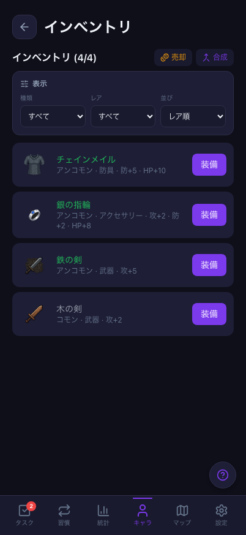 |  |
| 設定 | 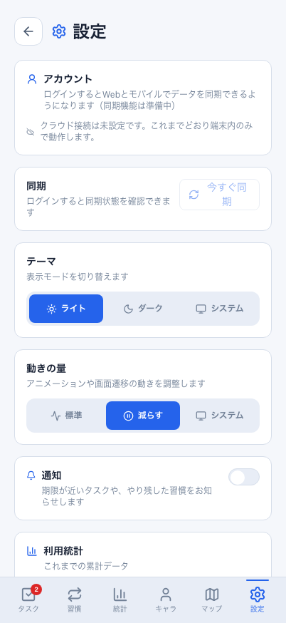 | 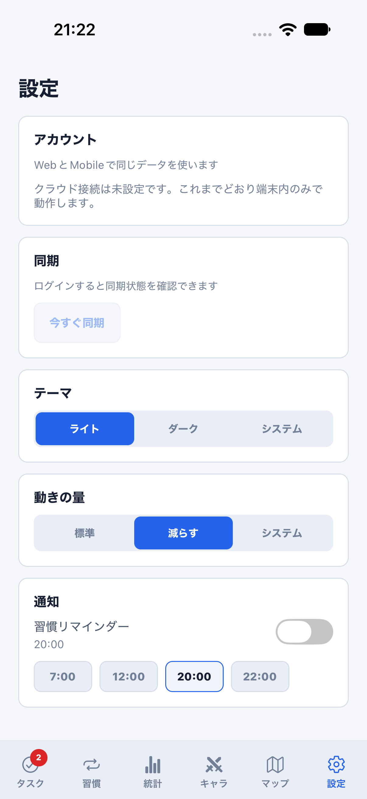 | 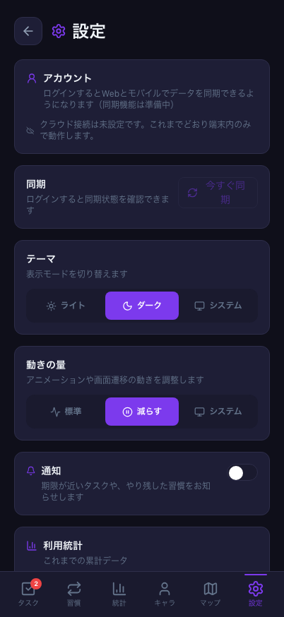 | 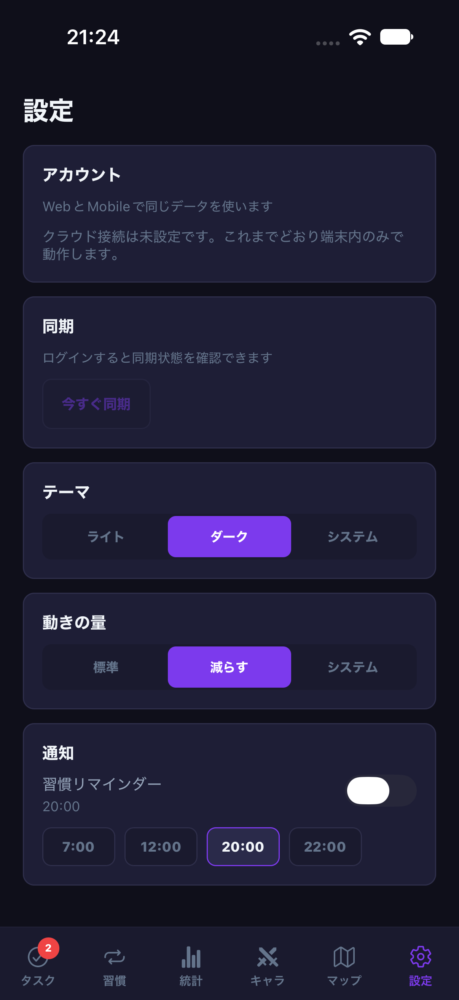 |

390×844の6画面dark baselineも、修正前後を目視確認して更新し、更新なしの回帰実行で検証済み。OSステータスバー・フォント描画の微差は対象外。DB/同期/保存形式/報酬計算は変更なし。
